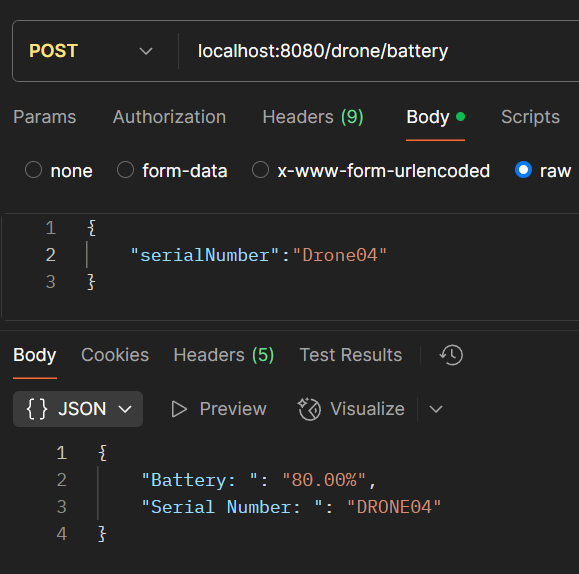

# TheDrone
“The Drone” is a new technology company which is working in the area of **drone-based delivery** for
urgent package delivery in locations with difficult access. The company has **a fleet of 10 drones**. A
drone is capable of delivering small load (payload) additionally to its navigation and cameras.

The service should be capable of doing:
* Registering a drone 
* Loading a drone with medication 
* Checking loaded medications for a given drone 
* Check drone availability for loading 
* Check drone information (Battery) 

==================================================================================

# BUILD INSTRUCTIONS
* SDK : Java 1.8
* Spring Boot version: 2.7.18
* Made in Windows 11 Pro
* run (localhost:8080) [TheDroneApplication](src/main/java/org/hitachi/drone/TheDroneApplication.java)
* Postman collection was included that can be imported for testing to purposes.

H2 **JDBC URL**: jdbc:h2:mem:drone \
H2 **User Name**: sa \
H2 **Password**: password \

----------------------------------------------------------------

# Registering a drone

**serialNumber**: Required / 100 characters max \
**model**: Required / (LIGHTWEIGHT, MIDDLEWEIGHT, CRUISERWEIGHT, HEAVYWEIGHT) \
**batteryCapacity**: Required  \
**state**: Required / (IDLE, LOADING, LOADED, DELIVERING, DELIVERED, RETURNING)

----------------------------------------------------------------
curl --location 'localhost:8080/drone/register' \
--header 'Content-Type: application/json' \
--data '{
"serialNumber":"DRONE05",
"model":"HEAVYWEIGHT",
"batteryCapacity":"100",
"state":"IDLE"
}'
----------------------------------------------------------------
Request body sample:

{
"serialNumber":"DRONE05",
"model":"HEAVYWEIGHT",
"batteryCapacity":"100",
"state":"IDLE"
}
----------------------------------------------------------------

==================================================================================

# Loading a drone with medication

**name**: Required / allowed only letters, numbers, -, _ \
**weight**: Required  \
**code**: Required / allowed only uppercase letters, underscores and numbers \
**image**: Required  \
**serialNumber**: Required / serialNumber of Drone 

----------------------------------------------------------------
curl --location 'localhost:8080/drone/load' \ 
--header 'Content-Type: application/json' \
--data '{
"name":"Meds-01_002",
"weight":"50",
"code":"M-01-002",
"image":"m01002.png",
"serialNumber":"DRONE05"
}'
----------------------------------------------------------------
Request body sample:

{
"name":"Meds-01_002",
"weight":"50",
"code":"M-01-002",
"image":"m01002.png",
"serialNumber":"DRONE05"
}
----------------------------------------------------------------

==================================================================================

# Checking loaded medications for a given drone

**serialNumber**: Required

----------------------------------------------------------------
curl --location 'localhost:8080/drone/medication' \
--header 'Content-Type: application/json' \
--data '{
"serialNumber":"Drone05"
}'
----------------------------------------------------------------
Request body sample:

{
"serialNumber":"Drone05"
}
----------------------------------------------------------------

==================================================================================

# Check drone availability for loading

----------------------------------------------------------------
curl --location 'localhost:8080/drone/battery' \
--header 'Content-Type: application/json' \
--data '{
"serialNumber":"Drone04"
}'
----------------------------------------------------------------
Request body sample:

N/A

----------------------------------------------------------------
Response body sample:

{
"availDroneList": [
{
"id": 1,
"serialNumber": "DRONE01",
"weightEnum": "LIGHTWEIGHT",
"batteryCapacity": 100.00,
"state": "IDLE",
"medication": null,
"createDate": "2025-04-11T00:42:50.020+00:00"
},
{
"id": 2,
"serialNumber": "DRONE02",
"weightEnum": "MIDDLEWEIGHT",
"batteryCapacity": 90.00,
"state": "IDLE",
"medication": null,
"createDate": "2025-04-11T00:42:50.020+00:00"
}
]
}
----------------------------------------------------------------

==================================================================================

# Check drone information (Battery)

**serialNumber**: Required

----------------------------------------------------------------
curl --location 'localhost:8080/drone/battery' \
--header 'Content-Type: application/json' \
--data '{
"serialNumber":"Drone04"
}'
----------------------------------------------------------------
Request body sample:

{
"serialNumber":"Drone04"
}
----------------------------------------------------------------

==================================================================================

# Scheduler
* @Scheduled(cron = "*/1 * * * * ?")
* The job will automatically handle the state transition.
* It will decrease the battery percentage every 1 second.
* Reduction in battery percentage varies depending on the drone state.
* Upon delivery completion, the total reduction in battery percentage will be 25%.

==================================================================================

# Unit Test
Run [DroneControllerTest](src/test/java/org/hitachi/drone/DroneControllerTest.java)
